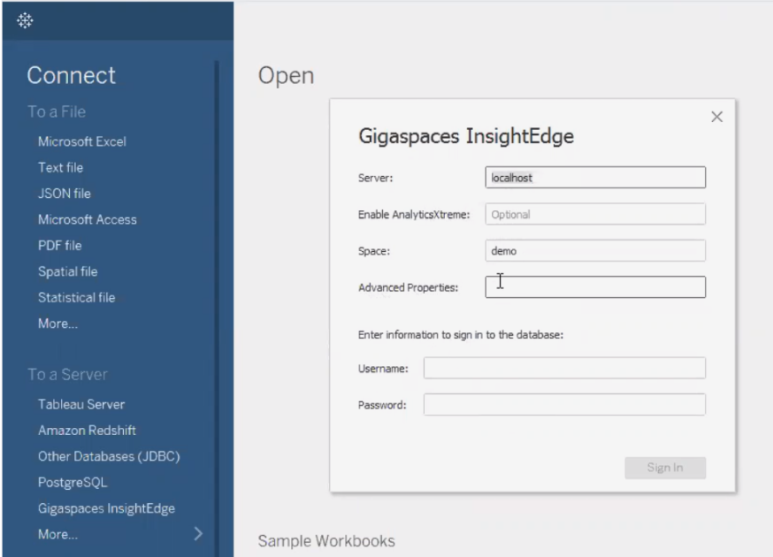
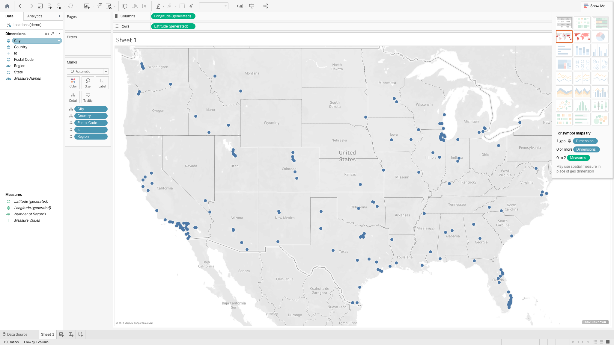

# Lab 19 Exercise: Tableau Integration

In this lab you will learn how to integrate Tableau with InsightEdge using the InsightEdge JDBC connector to retrieve data for visualization and business intelligence needs.

# Instructions
### 1. Configure IE_HOME variable to InsightEdge latest version
For example (Linux/mac): export IE_HOME=/Users/yuval/XAP-Builds/gigaspaces-insightedge-enterprise-14.5.0

### 2. Start InsightEdge in Demo mode
    cd $IE_HOME/bin/
    
#### Linux/Mac   
    ./gs.sh demo 
#### Windows
    gs.bat demo 
    
web-ui will lunched on http://localhost:8099  
zeppelin will lunched on http://localhost:9090  
REST Manager API will lunched on http://localhost:8090   

### 3. Write some data

1. Under the extracted insightedge-sql-demo folder, build the sample with mvn clean install  
        
        mvn clean install

2. Feed the demo space with data  

        java -jar target\insightedge-sql-demo.jar --space-url "jini://*/*/demo?locators=127.0.0.1" --lookup-group <DATA_GRID_LOOKUP_GROUP>
    

 
### 4. Starting Tableau
#### Linux / Mac

1. Download Tableau 2019.1 or higher from [here](https://www.tableau.com/trial/tableau-software?utm_campaign_id=2017049&utm_campaign=Prospecting-CORE-ALL-ALL-ALL-ALL&utm_medium=Paid+Search&utm_source=Google+Search&utm_language=EN&utm_country=MED&kw=%2Btableau&adgroup=CTX-Brand-Core-B&adused=336806490197&matchtype=b&placement=&gclid=CjwKCAjw-ITqBRB7EiwAZ1c5U3qli3LyKpES9OFiSueG8rd3s9zRIfUzDga4Ui9uzsARROZUyqqqzhoC5zMQAvD_BwE&gclsrc=aw.ds)
   and install it in the default location. 
2. Install the Maven artifacts  

         $IE_HOME/bin/gs.sh maven install
    

3. Create InsightEdge jdbc drive  

          cd $IE_HOME/tools/jdbc

          ./build-jdbc-client.sh

      insightedge-jdbc-client.jar will be created under $IE_HOME/tools/jdbc  
      
4. Copy insightedge-jdbc-client.jar to ~/Library/Tableau/Drivers/  

        cp $IE_HOME/tools/jdbc/insightedge-jdbc-client.jar ~/Library/Tableau/Drivers/
        
5. Run the Tableau application with -DConnectPluginsPath system property which point to the InsightEdge tableau folder.  

        "/Applications/Tableau Desktop 2019.2.app/Contents/MacOS/Tableau" -DConnectPluginsPath=$IE_HOME/tools/tableau 

#### Windows

1. Download Tableau 2019.1 or higher from [here](https://www.tableau.com/trial/tableau-software?utm_campaign_id=2017049&utm_campaign=Prospecting-CORE-ALL-ALL-ALL-ALL&utm_medium=Paid+Search&utm_source=Google+Search&utm_language=EN&utm_country=MED&kw=%2Btableau&adgroup=CTX-Brand-Core-B&adused=336806490197&matchtype=b&placement=&gclid=CjwKCAjw-ITqBRB7EiwAZ1c5U3qli3LyKpES9OFiSueG8rd3s9zRIfUzDga4Ui9uzsARROZUyqqqzhoC5zMQAvD_BwE&gclsrc=aw.ds)
   and install it in the default location. 

2. Start Tableau which include the InsightEdge integration:  

          $IE_HOME/tools/tableau/gs-tableau.bat

 
 ### 5. Connecting to the Space 
 
 Click Connect in the Tableau desktop, and select Gigaspaces InsightEdge as the data source.  
 Fill the "Server" and the "Space" fields and click on "Sign in"  
 For more information/trableshooting see [here](https://docs.gigaspaces.com/latest/dev-java/tableau-integration.html#ConnectingtotheSpace)   
 
   
 
  ### 6. Create a Symbol Maps chart
 
 Create a Symbol Maps chart using the Orders and the Locations data.  
 
     
 
 
 
 
  