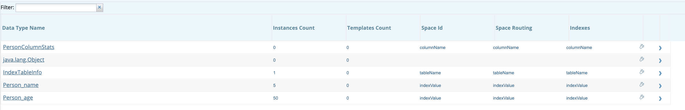

# Lab: AnalyticXtreme

# Instructions

**1.** Run mvn clean install 

**2.** Run fetchHiveJars.sh <path to ZIP you will run gs_home>

**3.** Run docker for hive - runHive.sh (make sure to install docker and docker composer before) -> use sudo

**4.** pip install docker -> to be able to import docker module from python.

**5.** Follow the docker post installation:
https://docs.docker.com/install/linux/linux-postinstall/

**6.** Run "python dnsthing.py" This script creates file hosts copy it's content to the end of your /etc/hosts file, 
Remember to do so everytime you stop/restart/kill your docker containers as their IP changes.
**Note:**
To debug python do --verbose

**7.** Create hive table - main in hive-initializer, and write to hive tables: 
    `mvn exec:java -Dexec.mainClass="com.gigaspaces.HiveCreateTable"` 
    `mvn exec:java -Dexec.mainClass="com.gigaspaces.HiveWriteToTable"` 

**8.** Start insightedge with 2 GSC: 
 `./gs.sh host run-agent --auto --gsc=2`

**9.** Deploy ax-pu jar: 
`./gs.sh pu deploy AxPu /home/vagrant/insightedge-training/Day5/20-data-lake-acceleration/Lab-19-Query-speed-batch/ax-pu/target/AxPu.jar`

**10.** Deploy index space pu (gs-home/insightedge/lib/analytics-xtreme/batch-index/batch-index.jar: 
`./gs.sh pu deploy index-pu /home/vagrant/gigaspaces-insightedge-enterprise-15.0.0-m20/insightedge/lib/analytics-xtreme/batch-index/batch-index.jar`

**11.** See existing types and data in index space using web-ui:

 
**12.** Perform queries - AXClient in remote-client module
`mvn exec:java -Dexec.mainClass="com.gigaspaces.AXClient"`

**13.** Examine statistics and index distributions, see files created in your training `home/logs`

**14.** Write new entries to speed space Client in remote-client module 
`mvn exec:java -Dexec.mainClass="com.gigaspaces.Client"`

**15.** Go to zeppelin, import exercise notebook

**16.** Create new **insightedge_jdbc_ax** interpreter (jdbc group) set url to `jdbc:insightedge:url=jini://*/*/speedSpace;analyticsXtreme.enabled=true` 
add property `com.gigaspaces.jdbc.autoCommit` and set its value to `true` 
Change `default.driver` to `com.gigaspaces.jdbc.Driver`

**17.** Create new  jdbc interpreter called **hive_jdbc** (jdbc group) set its  url to `hive2://hive-server:10000/;ssl=false` 
Change `default.driver` to `com.gigaspaces.jdbc.Driver`

**18.** Change in interpreter **insightedge_jdbc** `default.url` to `jdbc:insightedge:spaceName=speedSpace`

**19.** Follow instructions in the notebook 
